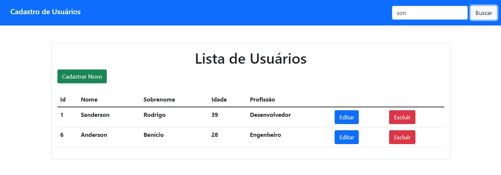

# CRUD Angular

## Sobre o Projeto:

> Este projeto é meu primero experimento com CRUD para Angular. Utilizado para aprendizado de estrutura de projeto, conexão com backends, modelos, serviços, módulos, rotas e bootstrap. Ele possui uma tela de listagem de usuários que você pode criar, editar, excluir e filtrar através da busca.

## Funcionamento

> As telas são simples e utilizam o Bootstrap em seu Layout. Tudo é bem intuitivo. Use o botão Excluir para deletar um usuário e os botões "Cadastrar Novo" ou "editar" irão levar a tela de formulário, onde você pode preencher os campos e salvar os dados. Esse salvamento pode ou não ser persistido! Como depende de um Backend, se o serviço apontar para uma API ou Servidor local, os dados podem se manter!

> A priori, o software tem uma variável em seu serviço chamada de "simulacaoBackend" que inicia ativa (TRUE) para poder apenas simular os dados, para utilizar um backend próprio é só setá-la para FALSE e colocar o apontamento do Backend em "apiUrl", que também é um variável do mesmo serviço.

> A busca funciona verificando todos os campos do usuário, basta escrever o que quiser filtrar e clicar em "Buscar". Para trazer os dados de volta, basta apagar o que estiver na entrada da pesquisa e clicar em "Buscar" novamente.

## Como usar

> Baixe o programa em seu computador, abra o terminal na pasta principal e digite: "ng serve" e entre em "http://localhost:4200/" ou apenas "ng serve -o" para ser levado para a página diretamente. Caso ele indique que falta algum arquivo durante o build ou algo do tipo, faça o comando "npm install" antes de tentar novamente. A simulação de backend estará ativa e você terá os dados mostrados na primeira imagem deste README, podendo fazer tudo o que aqui está escrito.

> Caso queira, pode, como eu, fazer um BACKEND para este projeto. É só seguir as instruções do apontamento descritas no [Funcionamento](#Funcionamento) quando estiver pronto.

> Os endpoints devem ser assim para cada método:

> **get**: {URL_que_voce_criou}  (Buscar Todos)

> **get**: {URL_que_voce_criou}/id/{id}

> **delete**: {URL_que_voce_criou}/id/{id}

> **post**: {URL_que_voce_criou}   (enviar User)

> **update**: {URL_que_voce_criou}/id/{id}

> Objeto:
> User {
  id: number; (Obrigatório)
  nome: string;
  sobrenome: string;
  idade: number;
  profissao: string;
}

## Tecnologias usadas no desenvolvimento

* **JavaScript** - Linguagem de programção usada na criação do projeto
* **HTML5** - Linguagem de marcação de texto
* **CSS** - Estilização da Ferramenta
* **Angular** - Framework de desenvolvimento Web Front-end
* **Bootstrap** - Framework de desenvolvimento Web Front-end

## Recursos

- [x] Tela de Listagem
- [x] Tela de Formulário
- [x] Bootstrap para Layout
- [x] Conexão de backend através de Serviço de usuário
- [x] CRUD completo - Criar, Ler, Atualizar e Deletar!
- [x] Implementação de buscar
- [x] Backend Simulado
